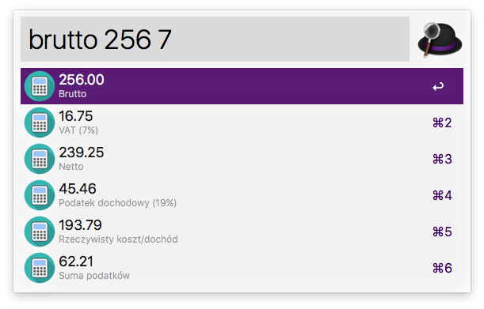
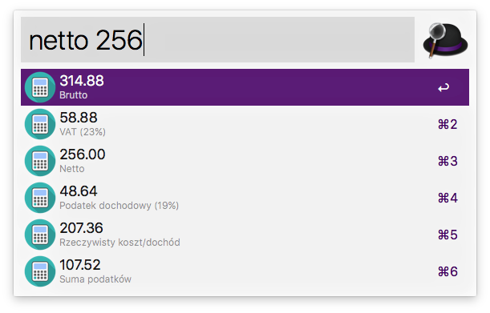

# Brutto-Netto Alfred Workflow

Workflow dla Alfreda, który w prosty sposób pozwala wyliczyć kwotę netto z kwoty brutto (i odwrotnie).

Użycie:

```
brutto {KWOTA_BRUTTO}
brutto {KWOTA_BRUTTO} {STAWKA_VAT}
netto {KWOTA_NETTO}
netto {KWOTA_NETTO} {STAWKA_VAT}
```





## Instalacja

Pobierz i uruchom plik [BruttoNetto](BruttoNetto.alfredworkflow)

## License

[MIT License](LICENSE). Copyright (c) 2017 Piotr Kuczynski
